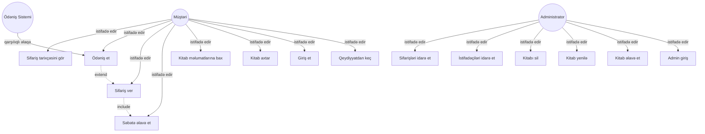
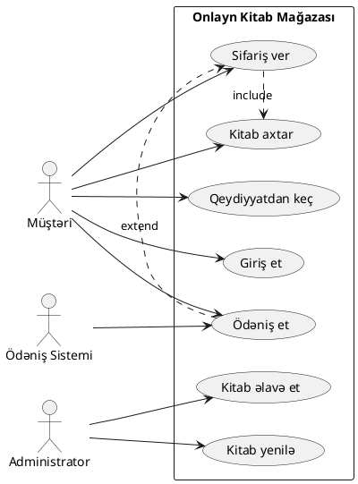

# Use Case Diaqramları

Use Case diaqramları, sistemin funksional tələblərini vizual şəkildə təqdim etmək üçün istifadə edilən UML diaqramlarıdır. Bu diaqramlar, sistemin xarici istifadəçiləri (aktorlar) və onların sistem ilə qarşılıqlı əlaqələrini göstərir.

Use Case diaqramları, proqram təminatının inkişaf prosesinin ilk mərhələsində, tələblərin toplanması və təhlili zamanı çox faydalıdır. Onlar biznes analitikləri, proqram mühəndisləri və müştərilər arasında ünsiyyəti asanlaşdırır.

## Use Case Diaqramının Komponentləri

### 1. Aktor (Actor)

Aktor, sistem xaricindəki bir varlığı təmsil edir və sistem ilə qarşılıqlı əlaqə yaradır. Aktor insan, başqa sistem və ya hər hansı xarici qurğu ola bilər.

**Aktor növləri:**
- **İnsanlar**: Sistem istifadəçiləri, administratorlar
- **Sistemlər**: Xarici API-lər, verilənlər bazası sistemləri
- **Qurğular**: Sensor, printer, mobil qurğular

### 2. Use Case

Use Case, sistemin həyata keçirdiyi xüsusi bir funksiya və ya xidməti təmsil edir. Hər Use Case müəyyən bir məqsədə çatmaq üçün sistemlə aktor arasında baş verən qarşılıqlı əlaqələrin ardıcıllığını təsvir edir.

### 3. Sistem Sərhədi

Sistem sərhədi, nəyin sistem daxilində, nəyin sistem xaricində olduğunu göstərən xəttdir. Use Case-lər sistem daxilində, aktorlar isə sistem xaricində yerləşir.

### 4. Əlaqələr

Use Case diaqramlarında müxtəlif növ əlaqələr mövcuddur:
- **Association**: Aktor və Use Case arasında əlaqə
- **Include**: Bir Use Case digərini həmişə daxil edir
- **Extend**: Bir Use Case digərini şərti olaraq genişləndirir
- **Generalization**: Ümumi Use Case və onun spesifikasiyaları

## Use Case Diaqramı Necə Çəkilir?

### Addım 1: Aktorları Müəyyən Edin

```
Suallar:
- Sistem kim tərəfindən istifadə ediləcək?
- Sistemə hansı xarici sistemlər qoşulacaq?
- Sistemə hansı məlumatlar daxil ediləcək?
```

### Addım 2: Use Case-ləri Müəyyən Edin

```
Suallar:
- Hər aktor sistemdən nə istəyir?
- Sistemin əsas funksiyaları nələrdir?
- Hansı məlumatlar saxlanmalı və ya dəyişdirilməlidir?
```

### Addım 3: Əlaqələri Müəyyən Edin

Use Case-lər və aktorlar arasında əlaqələri çəkin və lazım olduqda include/extend əlaqələrini əlavə edin.

## Praktik Nümunə: Onlayn Kitab Mağazası

### Aktorlar:
- **Müştəri**: Kitab alıcısı
- **Administrator**: Sistem idarəçisi
- **Ödəniş Sistemi**: Xarici ödəniş API-si

### Use Case-lər:

<details>
<summary>Müştəri Use Case-ləri</summary>

```
1. Qeydiyyatdan keç
2. Giriş et
3. Kitab axtar
4. Kitab məlumatlarına bax
5. Səbətə əlavə et
6. Səbətdən sil
7. Sifariş ver
8. Ödəniş et
9. Sifariş tarixçəsini gör
```
</details>

<details>
<summary>Administrator Use Case-ləri</summary>

```
1. Sistemə giriş et
2. Kitab əlavə et
3. Kitab məlumatlarını yenilə
4. Kitabı sil
5. İstifadəçiləri idarə et
6. Sifarişləri idarə et
7. Hesabatları gör
```
</details>

### Mermaid ilə Use Case Diaqramı



## Use Case Diaqramının Üstünlükləri

### 1. Anlaşıqlı Komunikasiya
- Texniki olmayan şəxslər də asanlıqla başa düşə bilərlər
- Müştəri və inkişaf komandası arasında ünsiyyəti asanlaşdırır

### 2. Tələblərin Strukturlaşdırılması
- Sistem tələblərini sistemli şəkildə təqdim edir
- Gözləmə gedən funksiyaları müəyyənləşdirir

### 3. Test Ssenariləri Üçün Əsas
- Use Case-lər test ssenarilərinın yazılması üçün əsas rolunu oynayır
- Sistem testlərinin planlaşdırılmasında köməkçi olur

## Use Case Yazma Qaydaları

### 1. Aktor Perspektivindən Yazın
```
Yanlış: "Sistem istifadəçinin məlumatlarını yoxlayır"
Düzgün: "İstifadəçi öz məlumatlarını yoxlayır"
```

### 2. Feli Başlanğıcda İstifadə Edin
```
Yanlış: "Istifadəçi qeydiyyatı"
Düzgün: "Qeydiyyatdan keç"
```

### 3. Hər Use Case Müstəqil Dəyər Təqdim Etsin
```
Use Case "Giriş et" və "Parol yenilə" ayrı-ayrı dəyər təqdim edir
```

## PlantUML ilə Use Case Diaqramı



## Ümumi Səhvlər və Onlardan Çəkinmə Yolları

### 1. Çox Detallı Use Case-lər
```
Səhv: Hər addımı ayrı Use Case kimi göstərmək
Düzgün: Yüksək səviyyəli funksiyaları Use Case kimi göstərmək
```

### 2. Texniki Detalların Daxil Edilməsi
```
Səhv: "Verilənlər bazasından məlumat oxu"
Düzgün: "İstifadəçi məlumatlarını gör"
```

### 3. Include/Extend-in Yanlış İstifadəsi
```
Include: Həmişə baş verir (məcburi)
Extend: Şərti olaraq baş verir (ixtiyari)
```

## Nəticə

Use Case diaqramları, proqram təminatının tələblər analizi mərhələsində çox vacib bir vasitədir. Onlar sistemin funksional tələblərini sadə və anlaşıqlı şəkildə təqdim edir, müxtəlif tərəflər arasında ünsiyyəti asanlaşdırır və sonrakı inkişaf mərhələləri üçün əsas yaradır.

Düzgün hazırlanmış Use Case diaqramları:
- Tələblərin daha yaxşı başa düşülməsinə kömək edir
- Test ssenarilərinın hazırlanmasında əsas rolunu oynayır
- Proyektin planlaşdırılması və qiymətləndirilməsi üçün vacibdir
- Sistem arxitekturasının formalaşması prosesində istiqamət verir