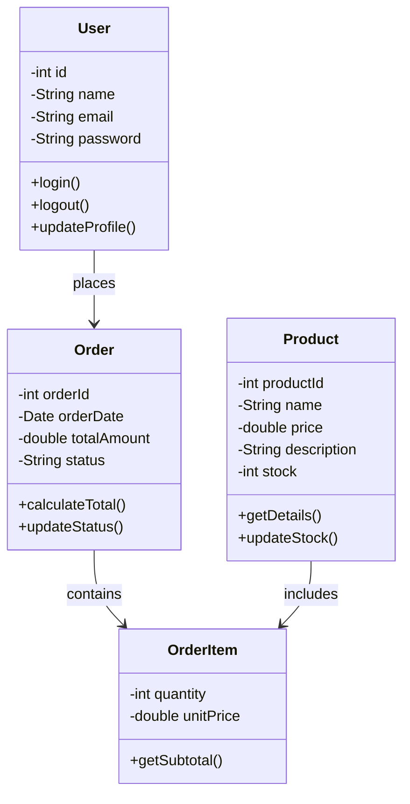
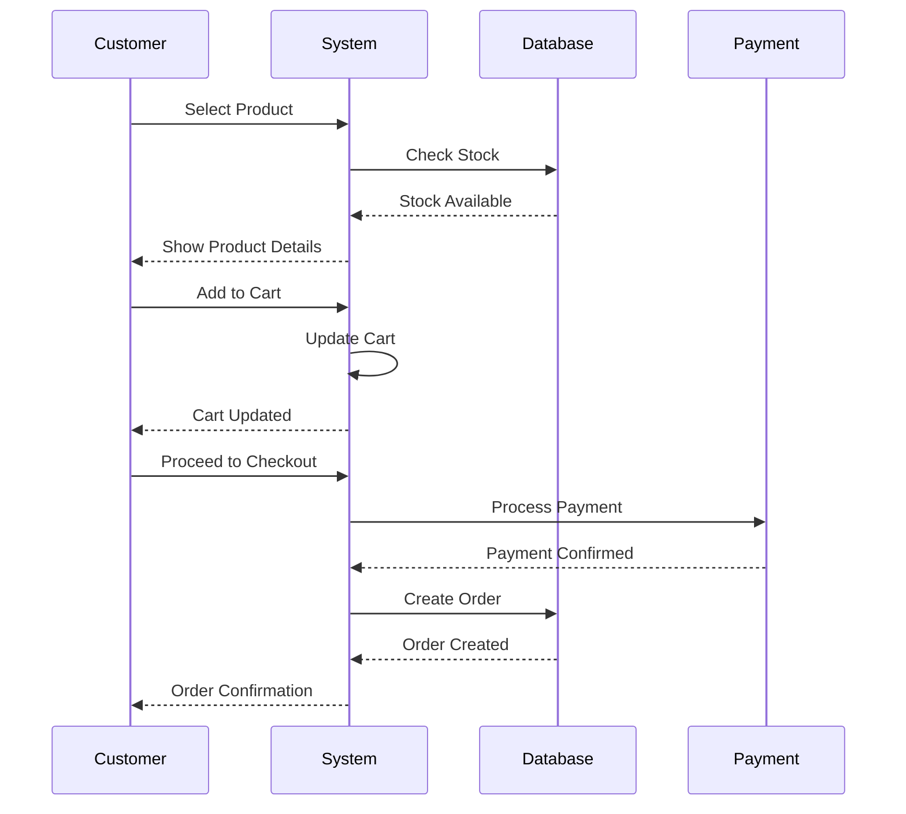
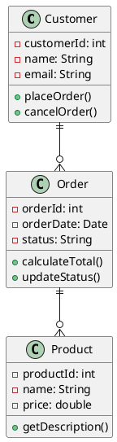
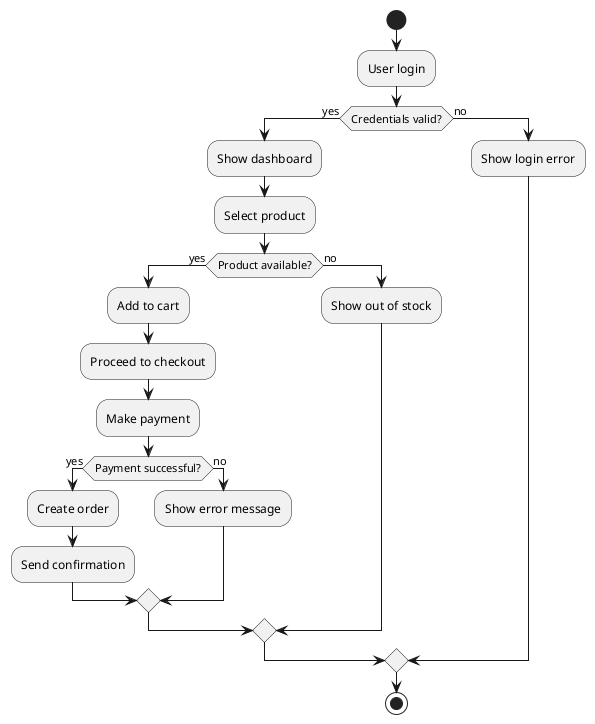

# UML (Unified Modeling Language) Diaqramları

UML (Unified Modeling Language) - proqram təminatının modelləşdirilməsi üçün standart qrafik dildir. UML diaqramları, sistemin müxtəlif aspektlərini vizual şəkildə təqdim etmək üçün istifadə edilir və proqram mühəndislərinin sistemi daha yaxşı anlaması, planlaşdırması və sənədləşdirməsinə kömək edir.

UML, Object Management Group (OMG) tərəfindən hazırlanmışdır və proqram təminatı inkişaf sənayesində geniş istifadə edilir. Bu dil, obyekt yönümlü və komponent əsaslı sistemlərin modelləşdirilməsi üçün nəzərdə tutulmuşdur.

## UML Tarixçəsi

UML-in yaranması 1990-cı illərin ortalarına təsadüf edir:

- **1994-1995**: Grady Booch, James Rumbaugh və Ivar Jacobson öz metodlarını birləşdirmək qərarına gəldilər
- **1996**: UML 0.9 versiyası buraxıldı
- **1997**: UML 1.1 OMG tərəfindən standart kimi qəbul edildi
- **2005**: UML 2.0 versiyası buraxıldı (əhəmiyyətli yeniliklər)
- **2017**: UML 2.5.1 hazırkı versiya

## UML Diaqramlarının Təsnifatı

UML diaqramları iki əsas kateqoriyaya bölünür:

### 1. Struktur Diaqramları (Structure Diagrams)

Bu diaqramlar sistemin statik strukturunu göstərir:

#### Class Diagram (Sinif Diaqramı)
- Sinifləri, onların atributlarını və metodlarını göstərir
- Siniflər arasında əlaqələri təsvir edir
- Sistem dizaynının əsasını təşkil edir

#### Object Diagram (Obyekt Diaqramı)  
- Müəyyən vaxtda obyektlərin vəziyyətini göstərir
- Class diaqramının konkret nümunəsidir

#### Component Diagram (Komponent Diaqramı)
- Sistemin komponentlərini və onlar arasında əlaqələri göstərir
- Modular sistemlərin təsvirinə yönəlmişdir

#### Deployment Diagram (Yerləşdirmə Diaqramı)
- Proqram komponentlərinin hardware üzərində yerləşdirilməsini göstərir
- Sistem topologiyasını təsvir edir

#### Package Diagram (Paket Diaqramı)
- Sistemin paketlərə bölünməsini və paketlər arasında əlaqələri göstərir

#### Composite Structure Diagram (Kompozit Struktur Diaqramı)
- Sinflərin daxili strukturunu detallı göstərir

### 2. Davranış Diaqramları (Behavior Diagrams)

Bu diaqramlar sistemin dinamik davranışını göstərir:

#### Use Case Diagram (İstifadə Halları Diaqramı)
- Sistemin funksional tələblərini göstərir
- Aktorlar və onların sistemlə qarşılıqlı əlaqəsini təsvir edir

#### Activity Diagram (Fəaliyyət Diaqramı)
- İş axınını və prosesləri göstərir
- İlə diaqramlarına oxşar davranış modelləşdirir

#### Sequence Diagram (Ardıcılliq Diaqramı)
- Obyektlər arasında mesaj mübadiləsini vaxt ardıcıllığı ilə göstərir
- Sistem dinamikasının detallı təsviri

#### Communication Diagram (Kommunikasiya Diaqramı)
- Obyektlər arasında mesaj mübadiləsini strukturla diqqət yetirərək göstərir
- Collaboration diagram kimi də tanınır

#### State Machine Diagram (Vəziyyət Maşını Diaqramı)
- Obyektin müxtəlif vəziyyətlərini və keçidlərini göstərir
- Reaktiv sistemlərin modelləşdirilməsi üçün istifadə edilir

#### Timing Diagram (Vaxt Diaqramı)
- Obyektlərin vəziyyət dəyişikliklərini vaxt çərçivəsində göstərir

#### Interaction Overview Diagram (Qarşılıqlı Əlaqə İcmal Diaqramı)
- Mürəkkəb qarşılıqlı əlaqələrin yüksək səviyyədə təsvirini verir

## UML Diaqramlarının İstifadə Sahələri

### 1. Tələblərin Analizi
```
Use Case diaqramları: Sistem tələblərinin təsviri
Activity diaqramları: Biznes proseslərinin modelləşdirilməsi
```

### 2. Sistem Dizaynı
```
Class diaqramları: Obyekt strukturunun dizaynı
Sequence diaqramları: Obyektlər arası qarşılıqlı əlaqə
Component diaqramları: Sistem arxitekturası
```

### 3. İmplementasiya
```
Class diaqramları: Kod strukturunun əsası
State Machine diaqramları: Kompleks davranış logikası
```

### 4. Sənədləşdirmə
```
Deployment diaqramları: Sistem topologiyası
Package diaqramları: Sistem təşkili
```

## Praktik Nümunə: E-ticarət Sistemi

### Class Diaqramı Nümunəsi



### Sequence Diaqramı Nümunəsi



## UML Vasitələri və Alətlər

### 1. Ödənişsiz Alətlər
- **StarUML**: Güclü UML modelləşdirmə vasitəsi
- **PlantUML**: Mətn əsaslı diaqram yaradıcısı
- **Draw.io**: Onlayn diaqram redaktoru
- **Lucidchart**: Veb əsaslı diaqram vasitəsi

### 2. Ödənişli Alətlər
- **Enterprise Architect**: Peşəkar UML vasitəsi
- **Visual Paradigm**: Tam funksiyalı modelləşdirmə platforması
- **IBM Rational Software Architect**: IBM-in UML vasitəsi
- **MagicDraw**: NoMagic tərəfindən hazırlanmış vasitə

### 3. IDE İnteqrasiyaları
- **IntelliJ IDEA**: UML plugin-ləri
- **Eclipse**: UML2 Tools
- **Visual Studio**: Class Designer
- **NetBeans**: UML dəstəyi

## PlantUML ilə Diaqram Yaratma

### Class Diaqramı



### Activity Diaqramı



## UML-in Üstünlükləri

### 1. Standartlaşdırma
- Beynəlxalq standartdır
- Bütün komanda üzvləri eyni dili istifadə edir
- Müxtəlif vasitələr arasında uyğunluq

### 2. Vizual Təqdimat
- Mürəkkəb sistemləri sadə şəkildə göstərir
- Sürətli anlayış və analiz imkanı
- Texniki olmayan şəxslər üçün anlaşıqlıdır

### 3. Sənədləşdirmə
- Sistemin bütün aspektlərini əhatə edir
- Uzunmüddətli sənədləşdirmə üçün ideal
- Yenidən istifadə edilə bilən materiallar

### 4. Dizayn və Analiz
- Erkən mərhələdə problemlərin aşkar edilməsi
- Sistem arquitekturasının planlaşdırılması
- Alternativ dizayn həllərinin müqayisəsi

## UML-in Çatışmazlıqları

### 1. Mürəkkəblik
- Böyük sistemlər üçün çox mürəkkəb ola bilər
- Öyrənmə dövrü uzun ola bilər
- Çox detallı modelləşdirmə vaxt aparır

### 2. Saxlama və Yeniləmə
- Kod dəyişdikdə diaqramlar yenilənməlidir
- Sinxronizasiya problemləri yarana bilər
- Manuel yeniləmələr səhvlərə yol aça bilər

### 3. Performans
- Böyük layihələrdə performans problemləri
- Rendering vaxtı uzun ola bilər
- Yaddaş istifadəsi artıq ola bilər

## UML Best Practice-lər

### 1. Məqsədyönlü Modelləşdirmə
```
Hər diaqramın məqsədi aydın olmalıdır
Lazımsız detallara vaxt ayırmayın
Konkret problemə fokuslanın
```

### 2. Sadəlik Prinsipi
```
Mümkün qədər sadə saxlayın
Çox mürəkkəb diaqramlardan çəkinin  
Bir diaqramda maksimum 7-9 element istifadə edin
```

### 3. Tutarlıliq
```
Eyni adlandırma konvensiyalarından istifadə edin
Rənglər və stillərdə ardıcıllıq saxlayın
Komanda standartlarını yərinə yetirin
```

### 4. Yeniləmə Strategiyası
```
Avtomatik kod generasiyası istifadə edin
Reverse engineering vasitələrindən yararlanın
Version control sistemlərində diaqramları saxlayın
```

## Agile və UML

Agile metodologiyalarda UML-in rolu:

### 1. Lightweight Modeling
- Çox detallı deyil, məqsədyönlü
- Just enough modeling prinsipi
- İterative yeniləmələr

### 2. Communication Tool
- Komanda üzvləri arasında ünsiyyət
- Müştəri ilə kommunikasiya
- Architecture decisions sənədləşdirilməsi

### 3. Spike Solutions
- Texniki risklərin araşdırılması
- Architecture POC-lar üçün
- Mürəkkəb hissələrin modelləşdirilməsi

## Nəticə

UML diaqramları, proqram təminatı inkişafının bütün mərhələlərində vacib rol oynayır. Düzgün istifadə edildikdə, onlar sistemin daha yaxşı anlaşılmasına, effektiv dizayn edilməsinə və keyfiyyətli sənədləşdirmə edilməsinə kömək edir.

Müasir proqram təminatı inkişafında UML-in əhəmiyyəti:
- Mürəkkəb sistemlərin vizuallaşdırılması
- Komanda üzvləri arasında effektiv kommunikasiya
- Architecture və dizayn qərarlarının sənədləşdirilməsi
- Sistem anlayışının və texniki borcun azaldılması
- Uzunmüddətli sistemin dəstəklənməsi və inkişafı