# Class Diaqramları

Class diaqramları UML-in ən məşhur və ən çox istifadə olunan struktural diaqramlarından biridir. Bu diaqramlar sistemin statik strukturunu göstərir və siniflər, onların atributları, metodları və aralarındakı əlaqələri vizual şəkildə təqdim edir.

Class diaqramları obyekt yönümlü proqramlaşdırmada fundamental rol oynayır və sistem dizaynının, kodun strukturunun və verilənlər bazası dizaynının əsasını təşkil edir. Onlar həm yüksək səviyyəli arxitektur qərarlarını, həm də aşağı səviyyəli implementasiya detallarını göstərə bilirlər.

## Class Diaqramının Əsas Komponentləri

### 1. Sinif (Class)

Sinif, eyni xüsusiyyətlərə və davranışlara malik obyektlərin abstrakt təsviridir. Class diaqramında sinif üç hissədən ibarət düzbucaqlı forma ilə təqdim edilir:

```
┌─────────────────┐
│   Sinif Adı     │
├─────────────────┤
│   Atributlar    │
├─────────────────┤
│   Metodlar      │
└─────────────────┘
```

### 2. Atributlar (Attributes)

Atributlar sinfin xüsusiyyətlərini və ya dəyişkənlərini təmsil edir. Hər atribut aşağıdakı formatla yazılır:

```
visibility name : type = defaultValue
```

**Visibility (Görünürlük) işarələri:**
- `+` Public
- `-` Private  
- `#` Protected
- `~` Package (Default)

### 3. Metodlar (Methods)

Metodlar sinfin həyata keçirdiyi əməliyyatları və davranışları təmsil edir:

```
visibility name(parameters) : returnType
```

### 4. Əlaqələr (Relationships)

Siniflər arasında müxtəlif növ əlaqələr mövcuddur:

#### Association (Assosiasiya)
İki sinif arasında ümumi əlaqəni göstərir.

#### Aggregation (Aqreqasiya)
"Hissə-bütün" əlaqəsini göstərir, lakin hissələr müstəqil mövcud ola bilər.

#### Composition (Kompozisiya)
Güçlü "hissə-bütün" əlaqəsi, hissələr bütün olmadan mövcud ola bilməz.

#### Inheritance (Varislik)
"is-a" əlaqəsini göstərir, alt sinif üst sinfin xüsusiyyətlərini miras alır.

#### Dependency (Asılıliq)
Bir sinifin digər sinfə asılı olduğunu göstərir.

#### Realization (Reallaşdırma)
Interface və onu implement edən sinif arasındakı əlaqə.

## Praktik Nümunə: Kitabxana İdarəetmə Sistemi

### Əsas Siniflər

<details>
<summary>Mermaid Class Diaqramı</summary>

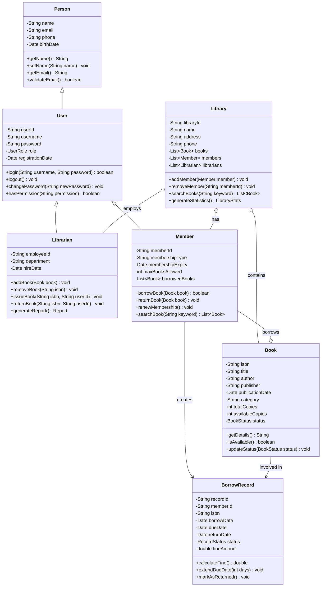
</details>

### PlantUML Class Diaqramı

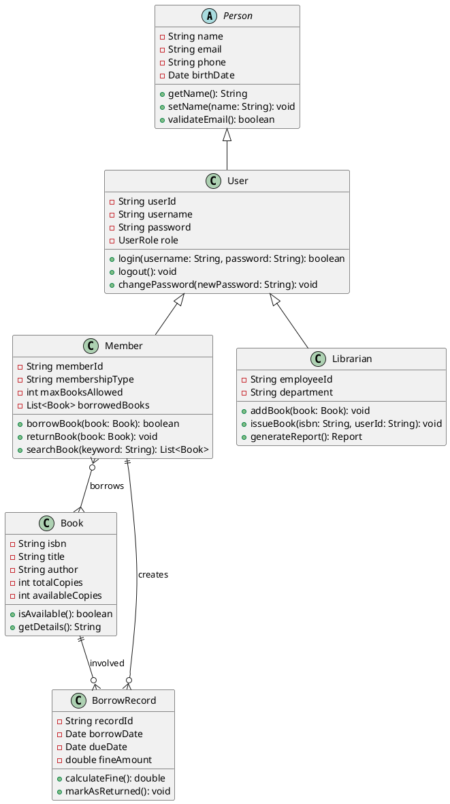

## Əlaqə Növləri və İstifadə Qaydaları

### 1. Association (Assosiasiya)

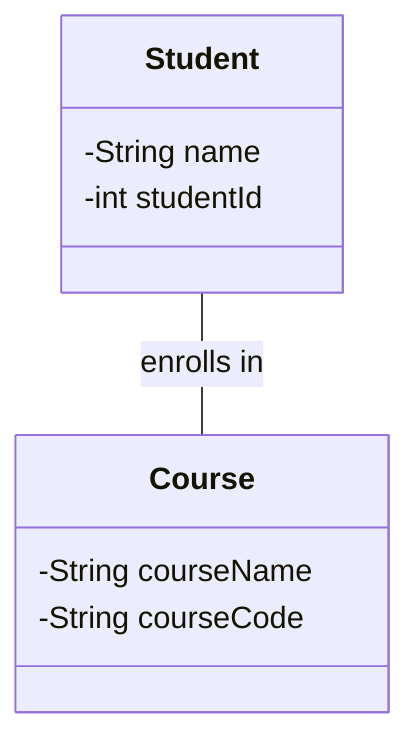

**İstifadə Sahəsi**: İki sinif arasında ümumi əlaqə olduqda.

### 2. Aggregation (Aqreqasiya)

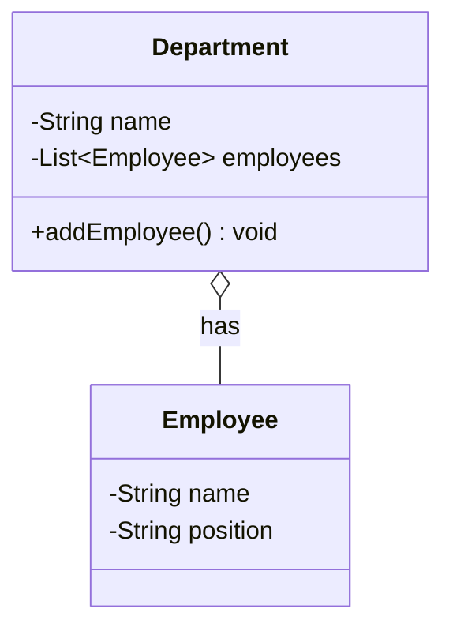

**İstifadə Sahəsi**: "Hissə-bütün" əlaqəsi olduqda, lakin hissələr müstəqil yaşaya bildikdə.

### 3. Composition (Kompozisiya)

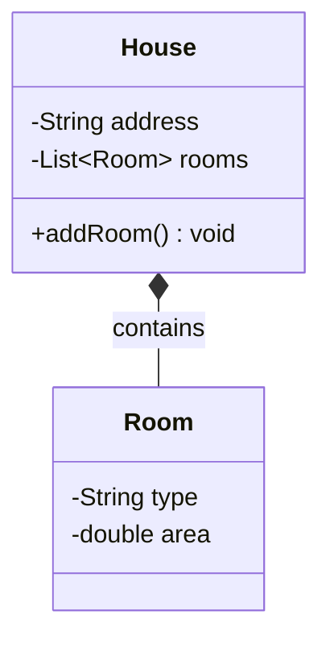

**İstifadə Sahəsi**: Güçlü "hissə-bütün" əlaqəsi olduqda, hissələr bütün olmadan yaşaya bilmədikdə.

### 4. Inheritance (Varislik)

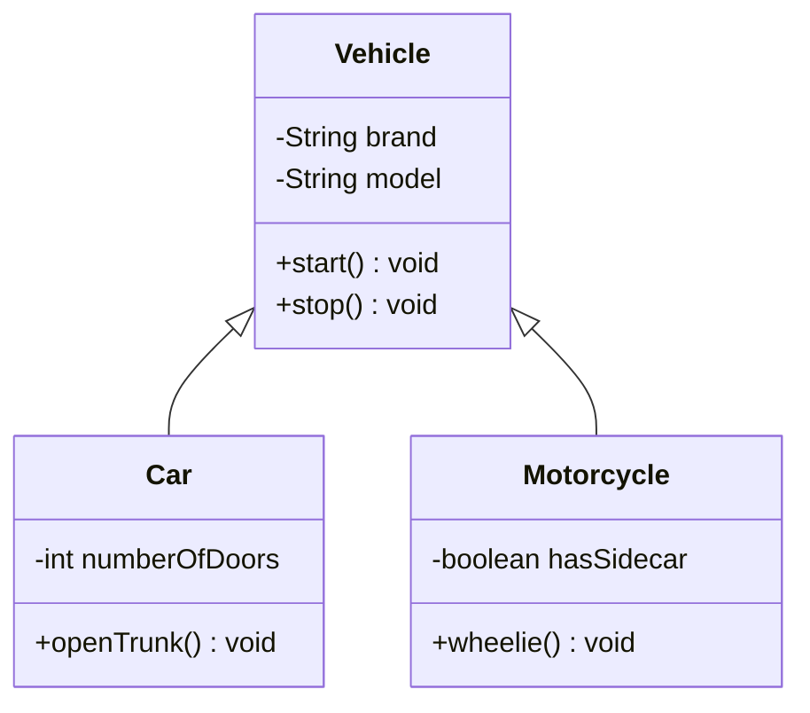

**İstifadə Sahəsi**: "is-a" əlaqəsi olduqda, alt sinif üst sinfin xüsusiyyətlərini miras aldıqda.

### 5. Dependency (Asılıliq)

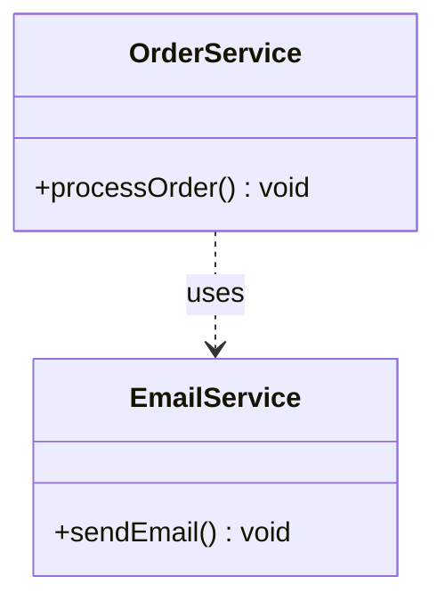

**İstifadə Sahəsi**: Bir sinif digər sinfi müvəqqəti olaraq istifadə etdikdə.

### 6. Realization (Reallaşdırma)

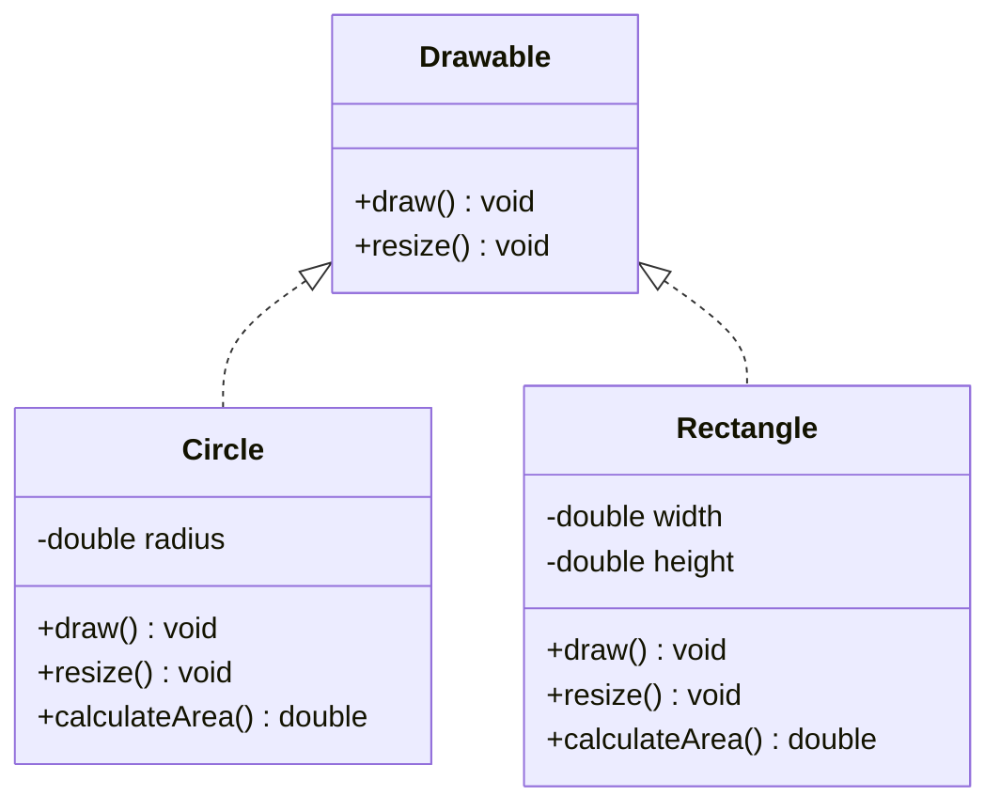

**İstifadə Sahəsi**: Interface və onu implement edən siniflər arasında.

## Multiplicity (Çoxluq) Göstəriciləri

Class diaqramlarında əlaqələrin sayını göstərmək üçün multiplicity istifadə edilir:

- `1` - Dəqiq bir
- `0..1` - Sıfır və ya bir
- `*` - Sıfır və ya daha çox
- `1..*` - Bir və ya daha çox
- `0..*` - Sıfır və ya daha çox
- `n` - Dəqiq n dənə
- `n..m` - n-dən m-ə qədər

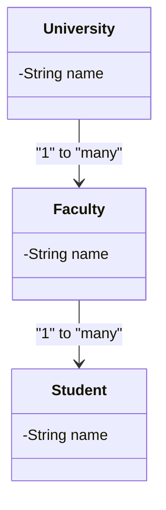

## Stereotyp və Tagged Values

### Stereotyplər

Stereotyplər sinflərin xüsusi növlərini göstərir:

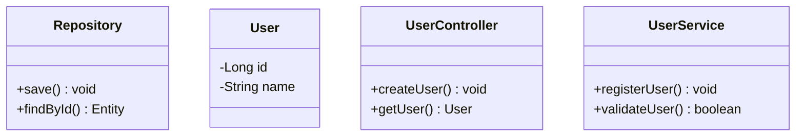

**Ümumi Stereotyplər:**
- `<<interface>>` - İnterfeys
- `<<abstract>>` - Abstrakt sinif
- `<<entity>>` - Verilənlər bazası entitysi
- `<<controller>>` - Kontroler sinif
- `<<service>>` - Servis sinif
- `<<repository>>` - Məlumat access layer

### Tagged Values

```
{author = "John Doe"}
{version = "2.1"}
{deprecated = true}
```

## Design Pattern-lərin Class Diaqramlarında Təsviri

### 1. Singleton Pattern

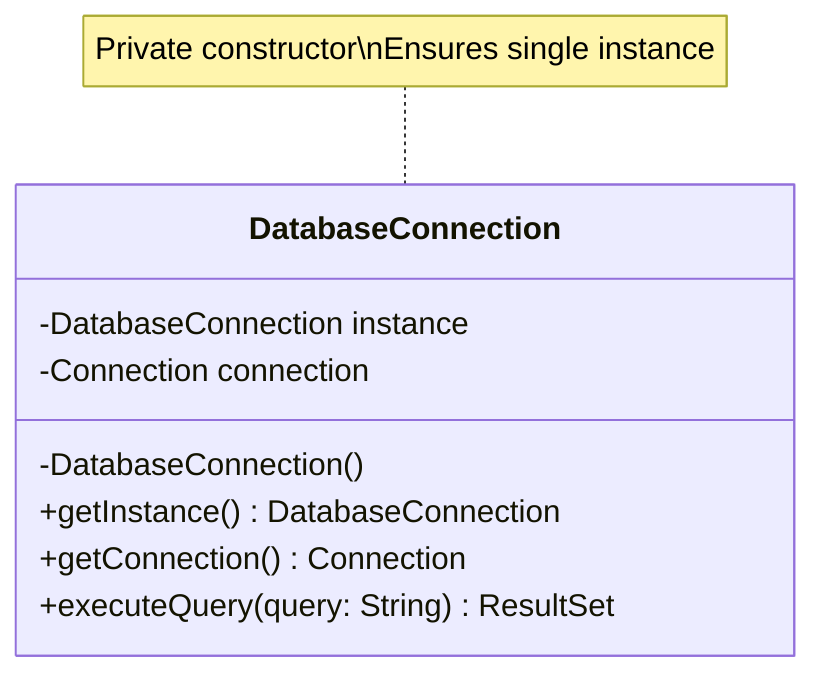

### 2. Factory Pattern

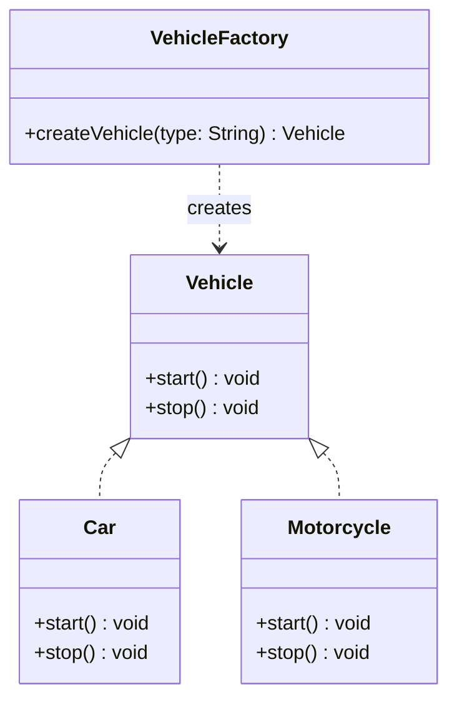

### 3. Observer Pattern

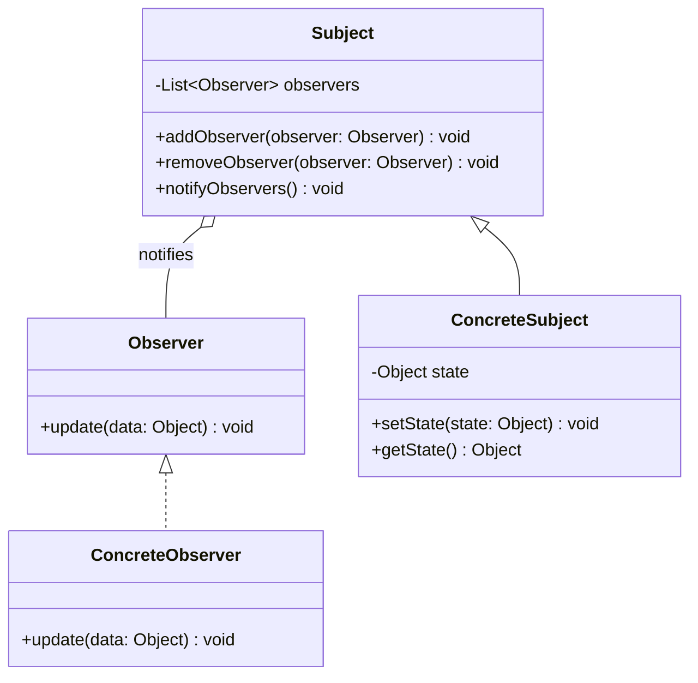

## Class Diaqramı Yaratmaq üçün Best Practice-lər

### 1. Sadəlik və Aydınliq

```
✅ Düzgün:
- Vacib siniflərə fokuslanın
- Məqsədə uyğun detalları daxil edin
- Anlaşıqlı adlar istifadə edin

❌ Yanlış:
- Bütün detalları bir diaqramda göstərmək
- Çox mürəkkəb əlaqələr yaratmaq
- Aydın olmayan adlandırma
```

### 2. Konsistent Adlandırma

```java
// Düzgün adlandırma
class UserService {
    private UserRepository userRepository;
    
    public User createUser(CreateUserRequest request) {
        // implementation
    }
}

// Yanlış adlandırma  
class usr_svc {
    private usr_repo repo;
    
    public usr make_usr(CreateUsrReq req) {
        // implementation
    }
}
```

### 3. Doğru Əlaqə Növü Seçimi

```
Association: İki sinif arasında ümumi əlaqə
Aggregation: Zəif "hissə-bütün" əlaqəsi
Composition: Güçlü "hissə-bütün" əlaqəsi
Inheritance: "is-a" əlaqəsi
Dependency: "uses" əlaqəsi
```

### 4. Multiplicity-nin Düzgün İstifadəsi

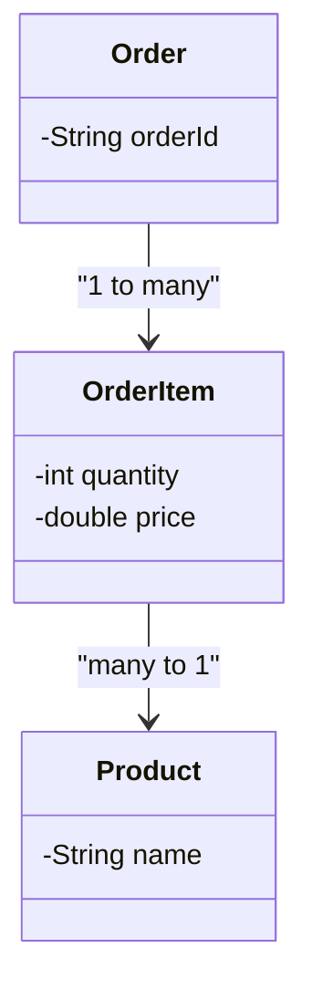

## Alətlər və Platformalar

### 1. Onlayn Vasitələr
- **Draw.io/Diagrams.net**: Pulsuz, güclü
- **Lucidchart**: Komanda üçün yaxşı
- **Creately**: İntuitiv interfeys
- **PlantUML**: Mətn əsaslı

### 2. Desktop Tətbiqlər
- **StarUML**: Professional UML tool
- **Visual Paradigm**: Tam funksiyalı
- **Enterprise Architect**: Korporativ həllər
- **ArgoUML**: Açıq mənbə

### 3. IDE Plugin-ləri
- **IntelliJ IDEA**: UML plugin
- **Eclipse**: UML2 Tools
- **Visual Studio**: Class Designer
- **NetBeans**: UML support

## Kod Generasiyası və Reverse Engineering

### Forward Engineering (Kod Generasiyası)

Class diaqramından kod generasiya etmək:

```java
// Generated from class diagram
public class User {
    private String userId;
    private String username;
    private String email;
    
    // Constructors
    public User() {}
    
    public User(String userId, String username, String email) {
        this.userId = userId;
        this.username = username;
        this.email = email;
    }
    
    // Getters and Setters
    public String getUserId() { return userId; }
    public void setUserId(String userId) { this.userId = userId; }
    
    public String getUsername() { return username; }
    public void setUsername(String username) { this.username = username; }
    
    public String getEmail() { return email; }
    public void setEmail(String email) { this.email = email; }
    
    // Methods
    public boolean validateEmail() {
        // Email validation logic
        return email != null && email.contains("@");
    }
}
```

### Reverse Engineering

Mövcud koddan class diaqram yaratmaq:

```bash
# PlantUML ilə Java kodundan diaqram yaratmaq
java -jar plantuml.jar -language java src/**/*.java
```

## Verilənlər Bazası Dizaynı ilə Əlaqə

Class diaqramları verilənlər bazası cədvəllərinin yaradılmasında da istifadə edilir:

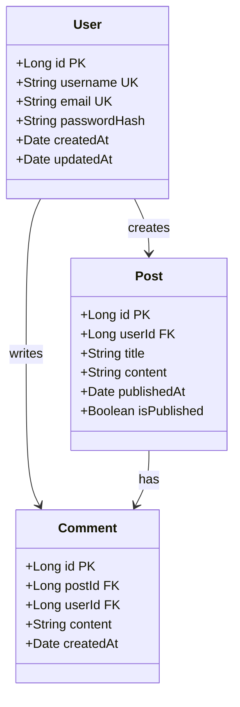

## Ümumi Səhvlər və Onlardan Çəkinmə

### 1. Çox Detallı Diaqramlar

```
Yanlış: Hər metod və atributu göstərmək
Düzgün: Məqsədə uyğun detalları seçmək
```

### 2. Yanlış Əlaqə Növü

```
Yanlış: Hər yerdə Association istifadə etmək
Düzgün: Düzgün əlaqə növünü seçmək
```

### 3. Multiplicity Görməzliyə Gəlmək

```
Yanlış: Əlaqələrdə multiplicity qeyd etməmək
Düzgün: Aydın multiplicity göstəriciləri
```

## Nəticə

Class diaqramları proqram təminatı dizaynının təməl daşıdır. Onlar:

- Sistemin statik strukturunu aydın şəkildə göstərir
- Kod yazıma əsas yaradır
- Komanda üzvləri arasında ünsiyyəti asanlaşdırır
- Verilənlər bazası dizaynına köməkçi olur
- Design pattern-lərin implementasiyasında istiqamət verir

Düzgün hazırlanmış class diaqramları:
- Sistemin anlaşılmasını asanlaşdırır
- Kod keyfiyyətini artırır
- Təkrar istifadə oluna bilən komponentlərin yaradılmasına kömək edir
- Sistem arxitekturasının sənədləşdirilməsini təmin edir