# Sequence Diaqramları

Sequence diaqramları UML-in davranış diaqramlarından biridir və obyektlər arasında mesaj mübadiləsinin vaxt ardıcıllığı ilə təsvirini göstərir. Bu diaqramlar sistemin dinamik davranışını, obyektlərin qarşılıqlı əlaqəsini və proseslərin necə baş verdiyini vizual şəkildə təqdim edir.

Sequence diaqramları xüsusilə sistem dizaynı, API dokumentasiyası, biznes proseslərinin təsviri və test ssenarilərinə yazılmasında çox faydalıdır. Onlar zaman faktoru nəzərə alaraq obyektlər arasında olan əlaqələri göstərir və mürəkkəb proseslərin anlaşılmasını asanlaşdırır.

## Sequence Diaqramının Əsas Komponentləri

### 1. Aktor (Actor)

Aktor sistemə xaricdən təsir edən bir varlığı təmsil edir. Bu insan, başqa sistem və ya xarici servis ola bilər.

### 2. Obyekt (Object)

Sequence diaqramında iştirak edən sistem komponentlərini və ya siniflərin nümunələrini təmsil edir.

### 3. Lifeline (Həyat Xətti)

Hər aktor və obyekt üçün şaquli xətt çəkilir ki, bu da həmin varlığın diagram müddətində mövcudluğunu göstərir.

### 4. Aktivasiya Qutusu (Activation Box)

Lifeline üzərində yerləşən və obyektin aktiv olduğu zaman müddətini göstərən düzbucaqlı qutu.

### 5. Mesaj (Message)

Obyektlər arasında həyata keçirilən kommunikasiya və ya funksiya çağırışları.

### 6. Return Mesajı

Funksiya çağırışının cavabını və ya nəticəsini göstərən mesaj.

## Mesaj Növləri

### 1. Synchronous Message (Sinxron Mesaj)
- Göndərən obyekt cavab gözləyir
- Dolu ox başı ilə gösterilir: `→`

### 2. Asynchronous Message (Asinxron Mesaj) 
- Göndərən obyekt cavab gözləmir
- Açıq ox başı ilə gösterilir: `⇢`

### 3. Return Message (Qayıdış Mesajı)
- Funksiya çağırışının nəticəsi
- Qırıqlı xətt ilə gösterilir: `⇠`

### 4. Self Message (Özünə Mesaj)
- Obyekt öz metodunu çağırır
- Lifeline üzərində dövrə şəkil alır

### 5. Create Message (Yaratma Mesajı)
- Yeni obyektin yaradılması
- `<<create>>` stereotipi ilə işarələnir

### 6. Destroy Message (Məhv Etmə Mesajı)
- Obyektin məhv edilməsi
- `<<destroy>>` stereotipi ilə işarələnir və lifeline X ilə bitir

## Praktik Nümunə: Onlayn Sifariş Sistemi

### Sadə Sifariş Prosesi

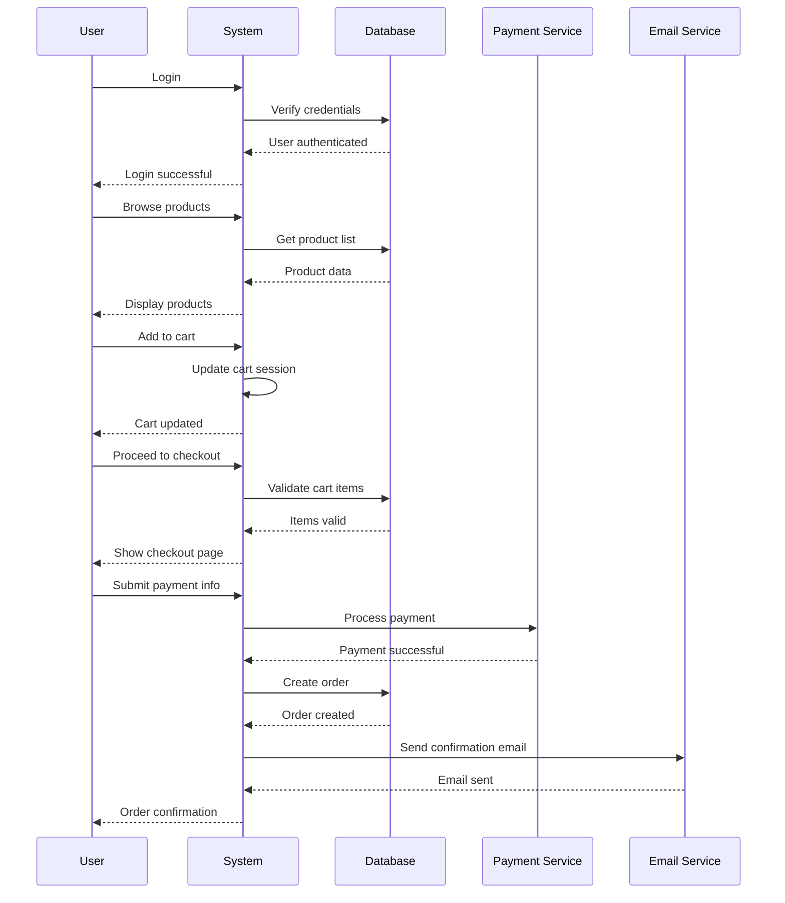
```mermaid
sequenceDiagram
    participant U as User
    participant S as System
    participant DB as Database
    participant PS as Payment Service
    participant ES as Email Service

    U->>S: Login
    S->>DB: Verify credentials
    DB-->>S: User authenticated
    S-->>U: Login successful

    U->>S: Browse products
    S->>DB: Get product list
    DB-->>S: Product data
    S-->>U: Display products

    U->>S: Add to cart
    S->>S: Update cart session
    S-->>U: Cart updated

    U->>S: Proceed to checkout
    S->>DB: Validate cart items
    DB-->>S: Items valid
    S-->>U: Show checkout page

    U->>S: Submit payment info
    S->>PS: Process payment
    PS-->>S: Payment successful
    S->>DB: Create order
    DB-->>S: Order created
    S->>ES: Send confirmation email
    ES-->>S: Email sent
    S-->>U: Order confirmation
```

### Detallı E-ticarət Sifariş Prosesi

<details>
<summary>Mürəkkəb Sequence Diaqramı</summary>

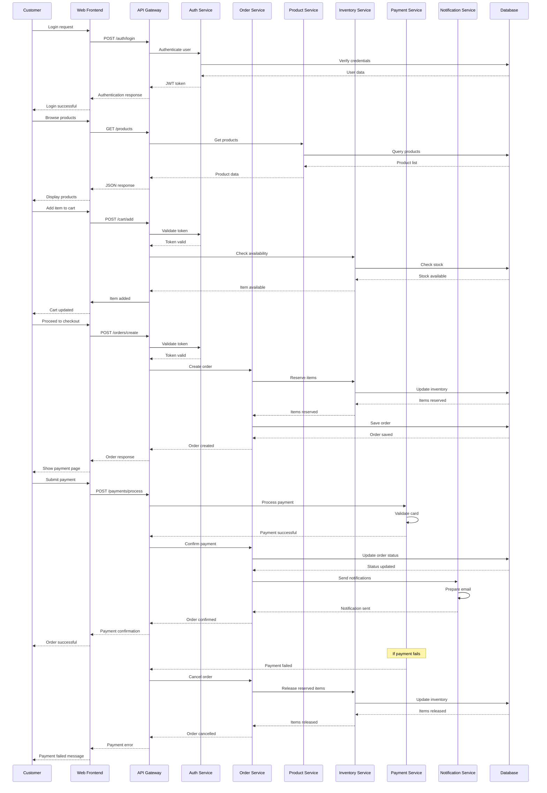
```mermaid
sequenceDiagram
    participant C as Customer
    participant W as Web Frontend
    participant A as API Gateway
    participant AS as Auth Service
    participant OS as Order Service
    participant PS as Product Service
    participant IS as Inventory Service
    participant PayS as Payment Service
    participant NS as Notification Service
    participant DB as Database

    %% Authentication
    C->>W: Login request
    W->>A: POST /auth/login
    A->>AS: Authenticate user
    AS->>DB: Verify credentials
    DB-->>AS: User data
    AS-->>A: JWT token
    A-->>W: Authentication response
    W-->>C: Login successful

    %% Product browsing
    C->>W: Browse products
    W->>A: GET /products
    A->>PS: Get products
    PS->>DB: Query products
    DB-->>PS: Product list
    PS-->>A: Product data
    A-->>W: JSON response
    W-->>C: Display products

    %% Add to cart
    C->>W: Add item to cart
    W->>A: POST /cart/add
    A->>AS: Validate token
    AS-->>A: Token valid
    A->>IS: Check availability
    IS->>DB: Check stock
    DB-->>IS: Stock available
    IS-->>A: Item available
    A->>W: Item added
    W-->>C: Cart updated

    %% Checkout process
    C->>W: Proceed to checkout
    W->>A: POST /orders/create
    A->>AS: Validate token
    AS-->>A: Token valid
    A->>OS: Create order
    OS->>IS: Reserve items
    IS->>DB: Update inventory
    DB-->>IS: Items reserved
    IS-->>OS: Items reserved
    OS->>DB: Save order
    DB-->>OS: Order saved
    OS-->>A: Order created
    A-->>W: Order response
    W-->>C: Show payment page

    %% Payment processing
    C->>W: Submit payment
    W->>A: POST /payments/process
    A->>PayS: Process payment
    PayS->>PayS: Validate card
    PayS-->>A: Payment successful
    A->>OS: Confirm payment
    OS->>DB: Update order status
    DB-->>OS: Status updated
    OS->>NS: Send notifications
    NS->>NS: Prepare email
    NS-->>OS: Notification sent
    OS-->>A: Order confirmed
    A-->>W: Payment confirmation
    W-->>C: Order successful

    %% Error handling (alternative flow)
    Note over PayS: If payment fails
    PayS-->>A: Payment failed
    A->>OS: Cancel order
    OS->>IS: Release reserved items
    IS->>DB: Update inventory
    DB-->>IS: Items released
    IS-->>OS: Items released
    OS-->>A: Order cancelled
    A-->>W: Payment error
    W-->>C: Payment failed message
```

</details>

## PlantUML ilə Sequence Diaqramı

### Kitabxana Sistemi Nümunəsi

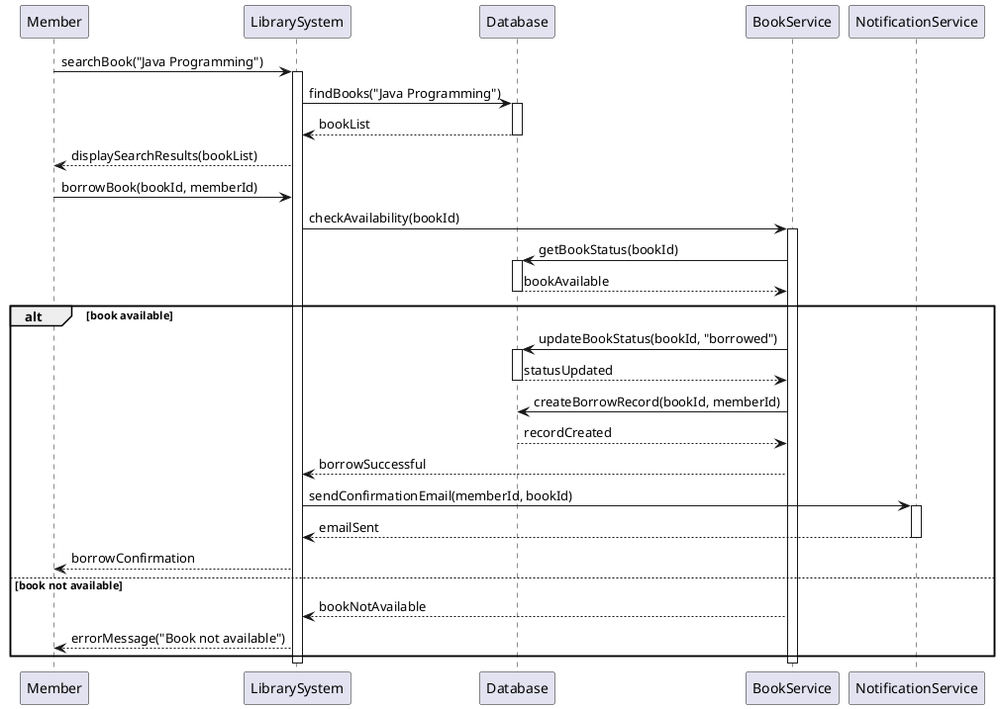
```plantuml
@startuml
participant Member
participant LibrarySystem as LS
participant Database as DB
participant BookService as BS
participant NotificationService as NS

Member -> LS : searchBook("Java Programming")
activate LS

LS -> DB : findBooks("Java Programming")
activate DB
DB --> LS : bookList
deactivate DB

LS --> Member : displaySearchResults(bookList)

Member -> LS : borrowBook(bookId, memberId)
LS -> BS : checkAvailability(bookId)
activate BS

BS -> DB : getBookStatus(bookId)
activate DB
DB --> BS : bookAvailable
deactivate DB

alt book available
    BS -> DB : updateBookStatus(bookId, "borrowed")
    activate DB
    DB --> BS : statusUpdated
    deactivate DB
    
    BS -> DB : createBorrowRecord(bookId, memberId)
    DB --> BS : recordCreated
    deactivate DB
    
    BS --> LS : borrowSuccessful
    
    LS -> NS : sendConfirmationEmail(memberId, bookId)
    activate NS
    NS --> LS : emailSent
    deactivate NS
    
    LS --> Member : borrowConfirmation
else book not available
    BS --> LS : bookNotAvailable
    LS --> Member : errorMessage("Book not available")
end

deactivate BS
deactivate LS
@enduml
```

## Sequence Diaqramında İstifadə Olunan Konstruksiyalar

### 1. Alt/Else (Alternativ)

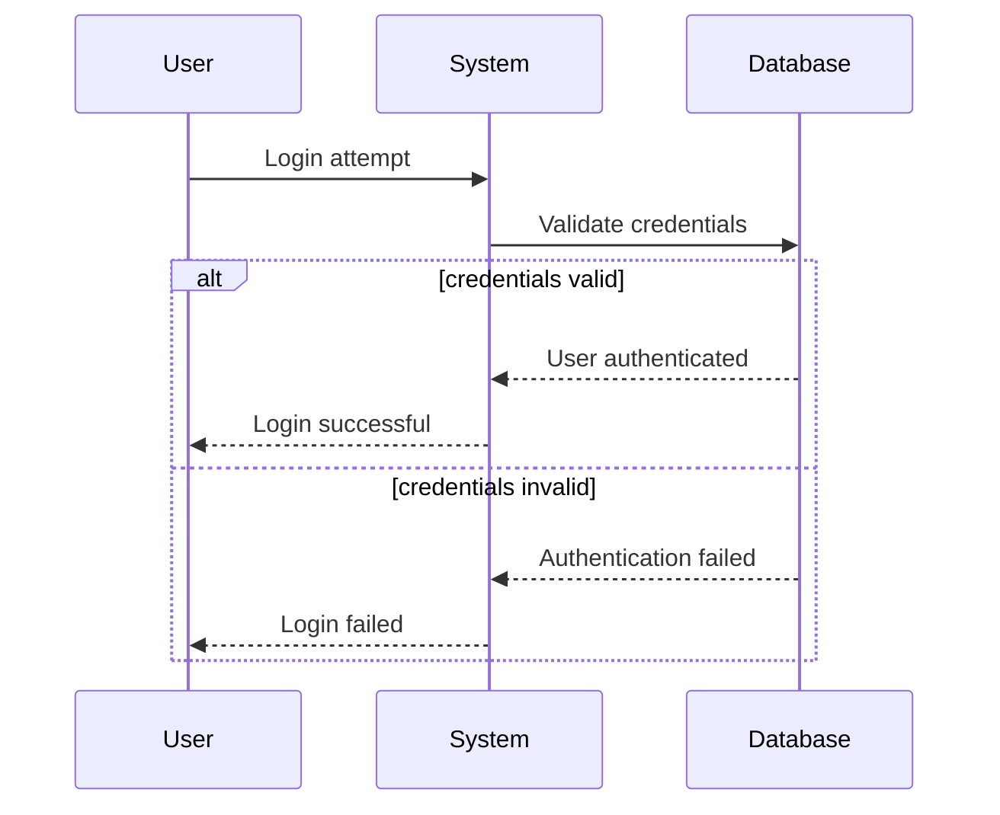
```mermaid
sequenceDiagram
    participant User
    participant System
    participant Database

    User->>System: Login attempt
    System->>Database: Validate credentials
    
    alt credentials valid
        Database-->>System: User authenticated
        System-->>User: Login successful
    else credentials invalid
        Database-->>System: Authentication failed
        System-->>User: Login failed
    end
```

### 2. Loop (Təkrarlama)

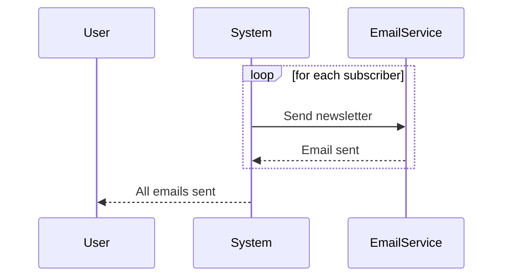
```mermaid
sequenceDiagram
    participant User
    participant System
    participant EmailService

    loop for each subscriber
        System->>EmailService: Send newsletter
        EmailService-->>System: Email sent
    end
    
    System-->>User: All emails sent
```

### 3. Par (Paralel Proseslər)

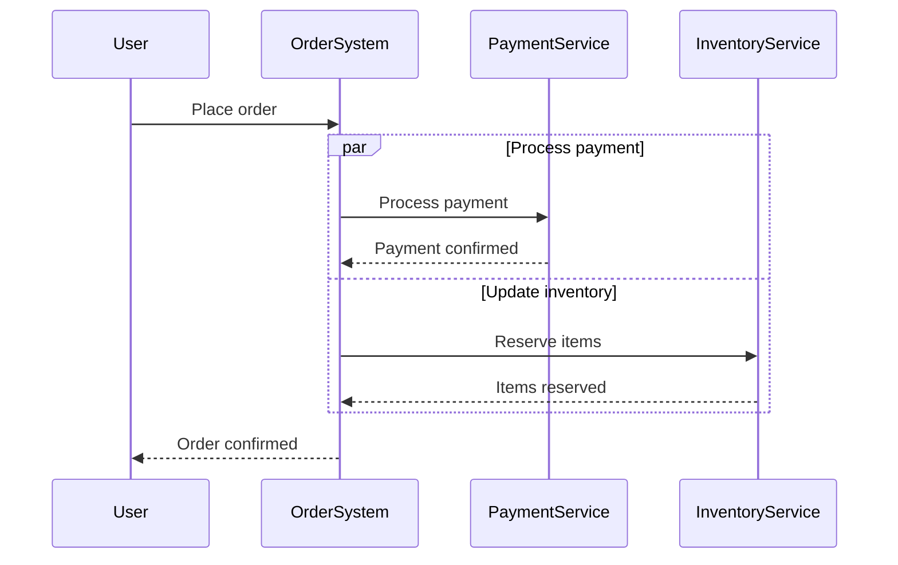
```mermaid
sequenceDiagram
    participant User
    participant OrderSystem
    participant PaymentService
    participant InventoryService

    User->>OrderSystem: Place order
    
    par Process payment
        OrderSystem->>PaymentService: Process payment
        PaymentService-->>OrderSystem: Payment confirmed
    and Update inventory
        OrderSystem->>InventoryService: Reserve items
        InventoryService-->>OrderSystem: Items reserved
    end
    
    OrderSystem-->>User: Order confirmed
```

### 4. Opt (İxtiyari)

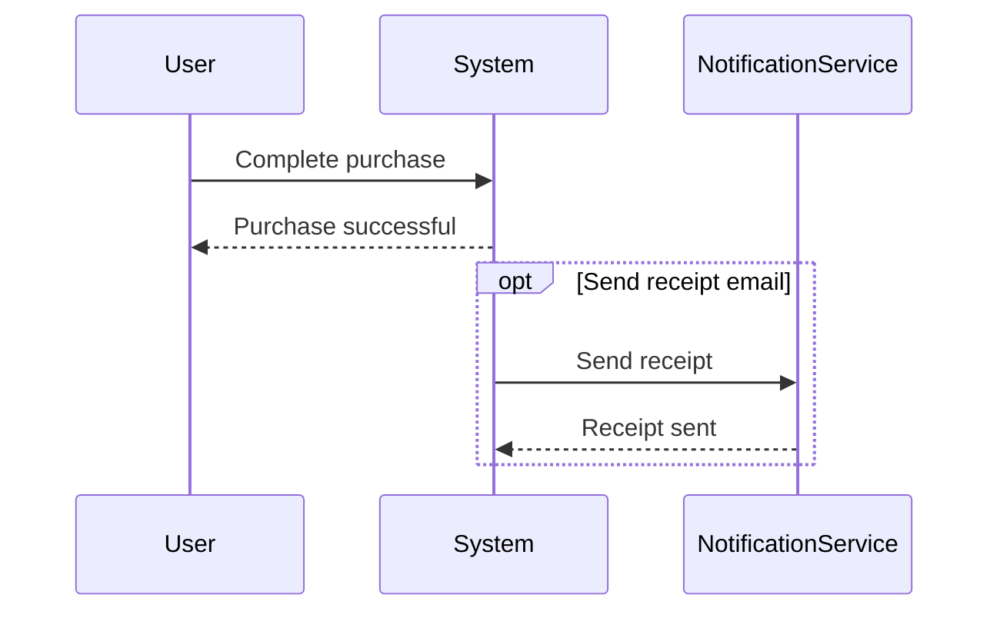
```mermaid
sequenceDiagram
    participant User
    participant System
    participant NotificationService

    User->>System: Complete purchase
    System-->>User: Purchase successful
    
    opt Send receipt email
        System->>NotificationService: Send receipt
        NotificationService-->>System: Receipt sent
    end
```

### 5. Break (Fasilə)

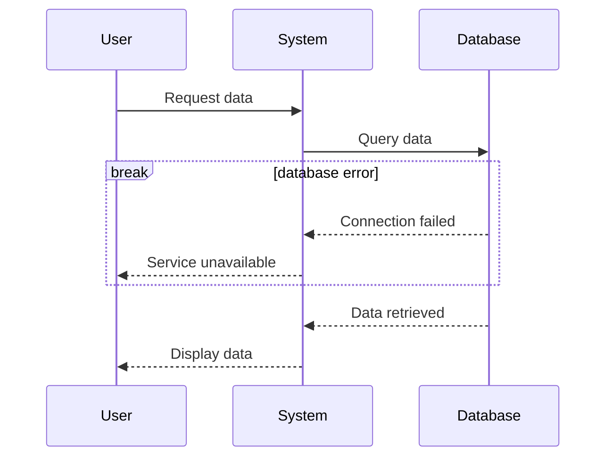
```mermaid
sequenceDiagram
    participant User
    participant System
    participant Database

    User->>System: Request data
    System->>Database: Query data
    
    break database error
        Database-->>System: Connection failed
        System-->>User: Service unavailable
    end
    
    Database-->>System: Data retrieved
    System-->>User: Display data
```

### 6. Critical (Kritik Bölgə)

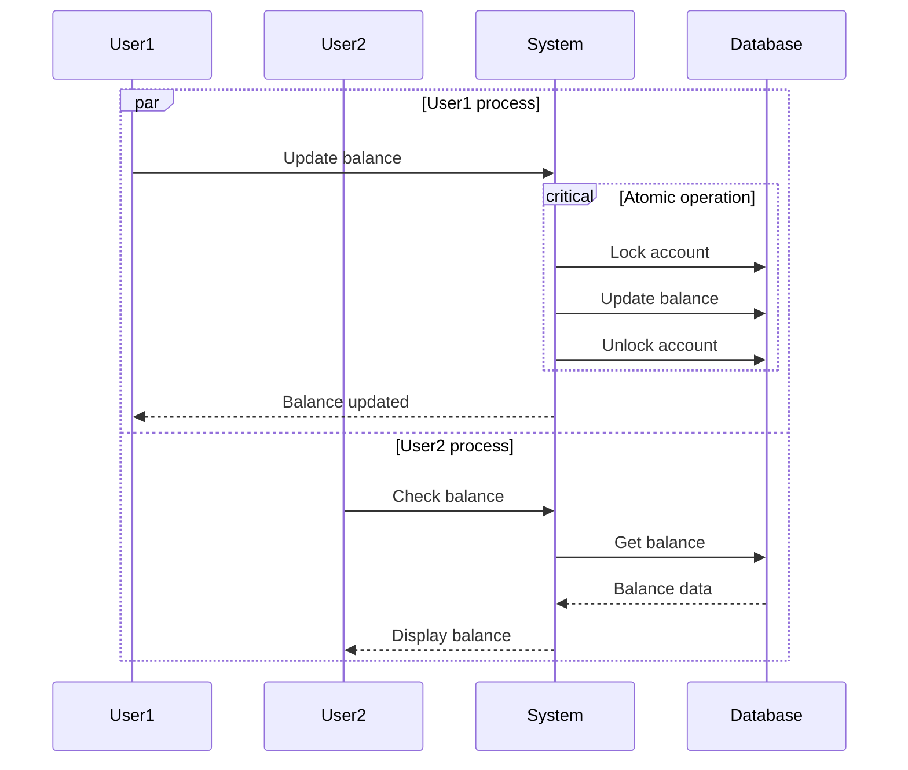
```mermaid
sequenceDiagram
    participant User1
    participant User2
    participant System
    participant Database

    par User1 process
        User1->>System: Update balance
        critical Atomic operation
            System->>Database: Lock account
            System->>Database: Update balance
            System->>Database: Unlock account
        end
        System-->>User1: Balance updated
    and User2 process
        User2->>System: Check balance
        System->>Database: Get balance
        Database-->>System: Balance data
        System-->>User2: Display balance
    end
```

## Sequence Diaqramı Best Practice-ləri

### 1. Aydın Adlandırma

```
✅ Düzgün:
- getUserProfile()
- processPayment()
- sendNotification()

❌ Yanlış:
- doSomething()
- process()
- handle()
```

### 2. Məntiqli Qruplaşdırma

```
Əlaqədar mesajları bir yerdə saxlayın
Sequence-i sol-sağ istiqamətində təşkil edin
Çox uzun diaqramları alt-diaqramlara bölün
```

### 3. Səhv Hallarının Nəzərə Alınması

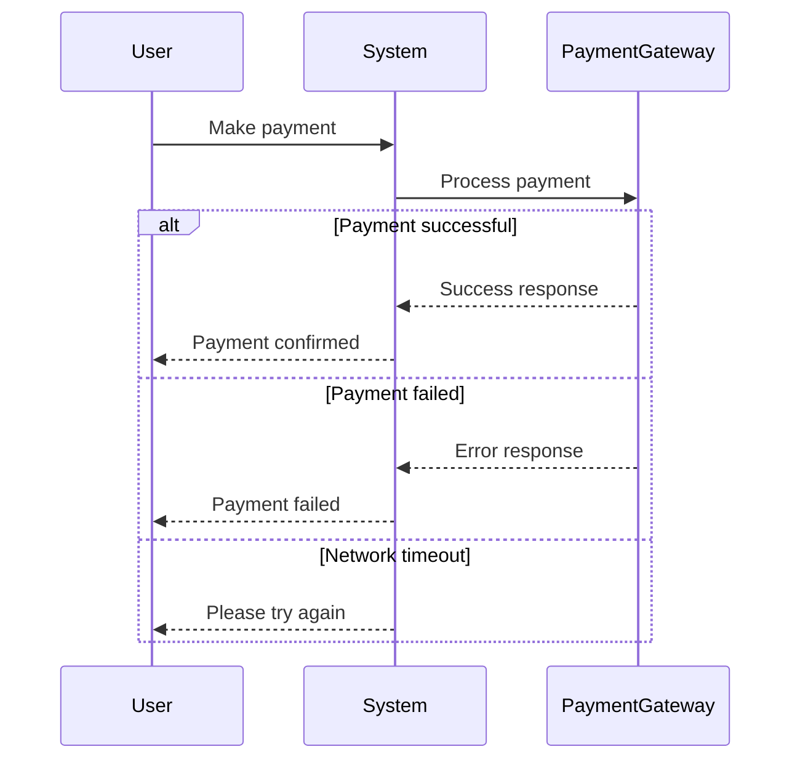
```mermaid
sequenceDiagram
    participant User
    participant System
    participant PaymentGateway

    User->>System: Make payment
    System->>PaymentGateway: Process payment
    
    alt Payment successful
        PaymentGateway-->>System: Success response
        System-->>User: Payment confirmed
    else Payment failed
        PaymentGateway-->>System: Error response
        System-->>User: Payment failed
    else Network timeout
        System-->>User: Please try again
    end
```

### 4. Return Mesajlarının İstifadəsi

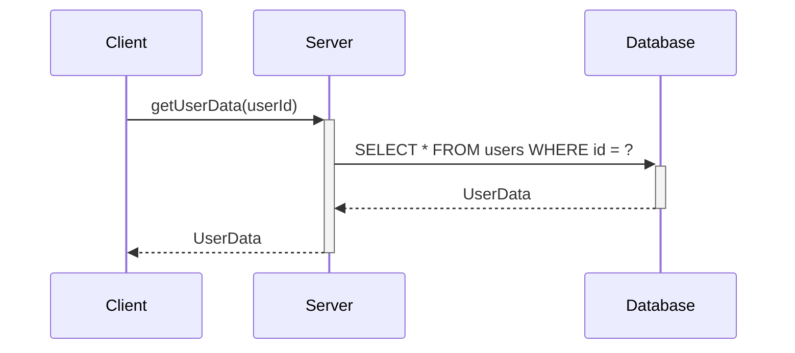
```mermaid
sequenceDiagram
    participant Client
    participant Server
    participant Database

    Client->>+Server: getUserData(userId)
    Server->>+Database: SELECT * FROM users WHERE id = ?
    Database-->>-Server: UserData
    Server-->>-Client: UserData
```

## Mikroservis Arxitekturasında Sequence Diaqramları

### API Gateway Pattern

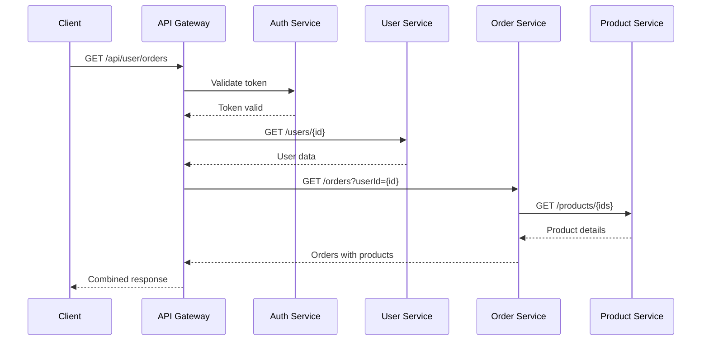
```mermaid
sequenceDiagram
    participant Client
    participant Gateway as API Gateway
    participant Auth as Auth Service
    participant User as User Service
    participant Order as Order Service
    participant Product as Product Service

    Client->>Gateway: GET /api/user/orders
    Gateway->>Auth: Validate token
    Auth-->>Gateway: Token valid
    
    Gateway->>User: GET /users/{id}
    User-->>Gateway: User data
    
    Gateway->>Order: GET /orders?userId={id}
    Order->>Product: GET /products/{ids}
    Product-->>Order: Product details
    Order-->>Gateway: Orders with products
    
    Gateway-->>Client: Combined response
```

### Event-Driven Architecture

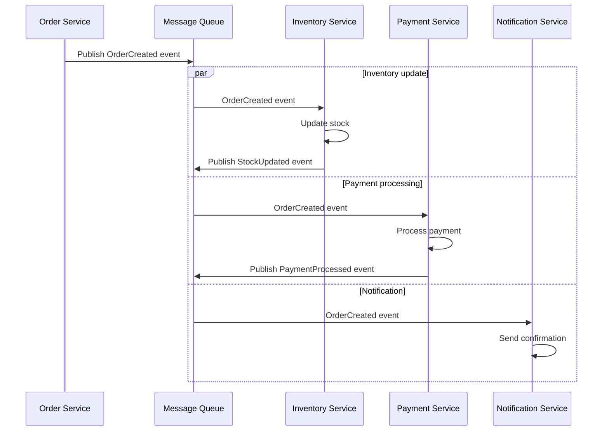
```mermaid
sequenceDiagram
    participant Order as Order Service
    participant Queue as Message Queue
    participant Inventory as Inventory Service
    participant Payment as Payment Service
    participant Notification as Notification Service

    Order->>Queue: Publish OrderCreated event
    
    par Inventory update
        Queue->>Inventory: OrderCreated event
        Inventory->>Inventory: Update stock
        Inventory->>Queue: Publish StockUpdated event
    and Payment processing
        Queue->>Payment: OrderCreated event
        Payment->>Payment: Process payment
        Payment->>Queue: Publish PaymentProcessed event
    and Notification
        Queue->>Notification: OrderCreated event
        Notification->>Notification: Send confirmation
    end
```

## Test Ssenariləri üçün Sequence Diaqramları

### API Test Ssenarisi

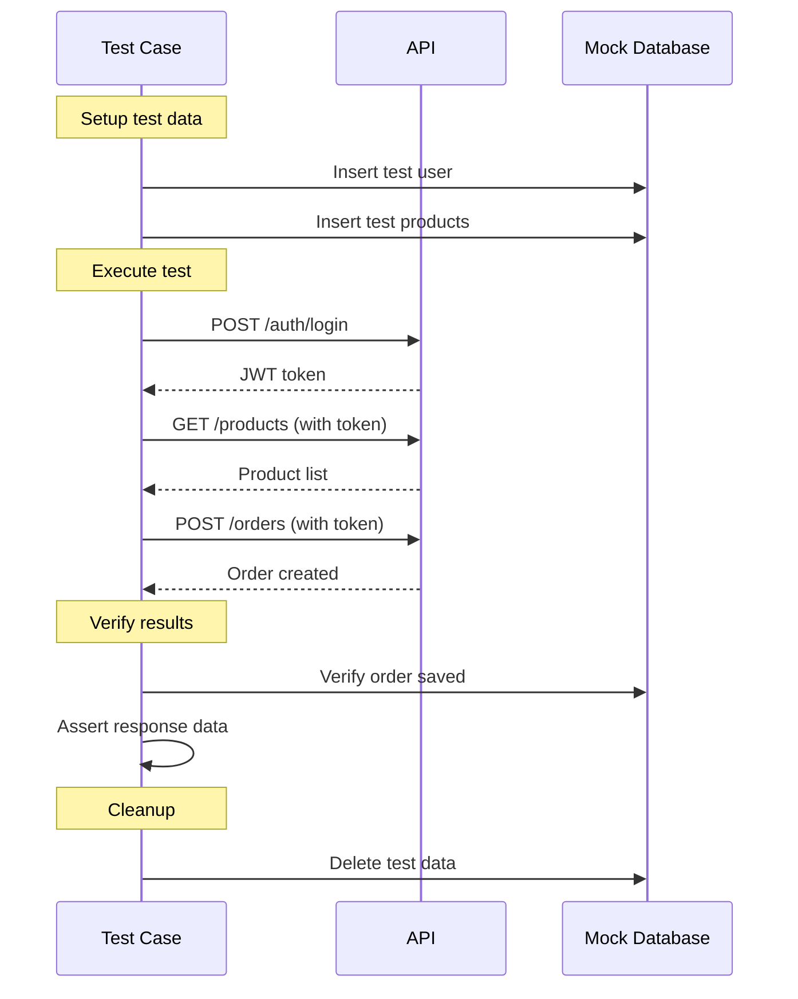
```mermaid
sequenceDiagram
    participant Test as Test Case
    participant API
    participant DB as Mock Database

    Note over Test: Setup test data
    Test->>DB: Insert test user
    Test->>DB: Insert test products
    
    Note over Test: Execute test
    Test->>API: POST /auth/login
    API-->>Test: JWT token
    
    Test->>API: GET /products (with token)
    API-->>Test: Product list
    
    Test->>API: POST /orders (with token)
    API-->>Test: Order created
    
    Note over Test: Verify results
    Test->>DB: Verify order saved
    Test->>Test: Assert response data
    
    Note over Test: Cleanup
    Test->>DB: Delete test data
```

## Sequence Diaqramı Alətləri

### 1. Onlayn Vasitələr
- **Mermaid.js**: Markdown-friendly
- **SequenceDiagram.org**: Sadə və sürətli
- **WebSequenceDiagrams**: Professional
- **Draw.io**: Vizual editor

### 2. Desktop Tətbiqlər
- **StarUML**: Professional UML suite
- **Visual Paradigm**: Tam funksiyalı
- **Enterprise Architect**: Korporativ həll
- **PlantUML**: Text-based

### 3. IDE Plugin-ləri
- **IntelliJ IDEA**: Sequence diagram plugin
- **VS Code**: Mermaid extension
- **Eclipse**: UML plugins
- **Sublime Text**: PlantUML plugin

## Ümumi Səhvlər və Onlardan Çəkinmə

### 1. Çox Mürəkkəb Diaqramlar

```
Səhv: Bütün detalları bir diaqramda göstərmək
Düzgün: Hər scenario üçün ayrı diaqram yaratmaq
```

### 2. Vaxt Ardıcıllığını Pozmaq

```
Səhv: Mesajları təsadüfi sırayla göstərmək
Düzgün: Real-time sequence-i izləmək
```

### 3. Return Mesajlarını Unutmaq

```
Səhv: Yalnız request mesajlarını göstərmək
Düzgün: Response mesajlarını da daxil etmək
```

### 4. Activation Box-ların Yanlış İstifadəsi

```
Səhv: Bütün lifeline-də aktivasiya göstərmək
Düzgün: Yalnız aktiv olduqda activation box istifadə etmək
```

## Performance və Scalability Göstəricisi

### Zaman Məhdudiyyətləri

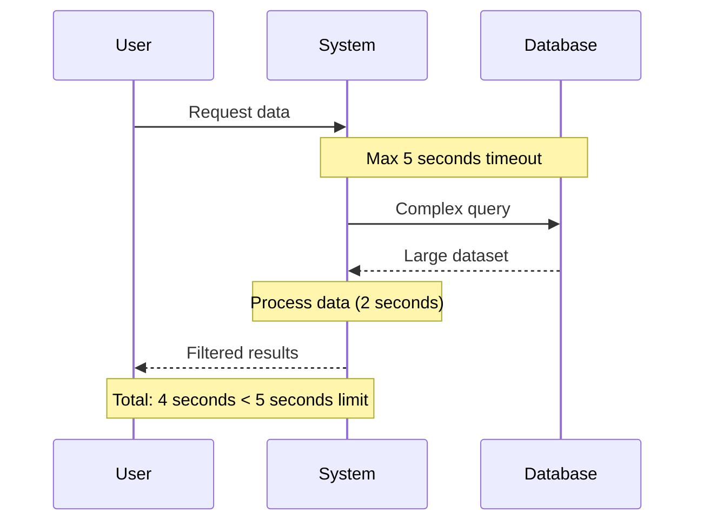
```mermaid
sequenceDiagram
    participant User
    participant System
    participant Database

    User->>System: Request data
    Note over System,Database: Max 5 seconds timeout
    System->>Database: Complex query
    Database-->>System: Large dataset
    Note over System: Process data (2 seconds)
    System-->>User: Filtered results
    
    Note over User,System: Total: 4 seconds < 5 seconds limit
```

### Caching Strategiyası

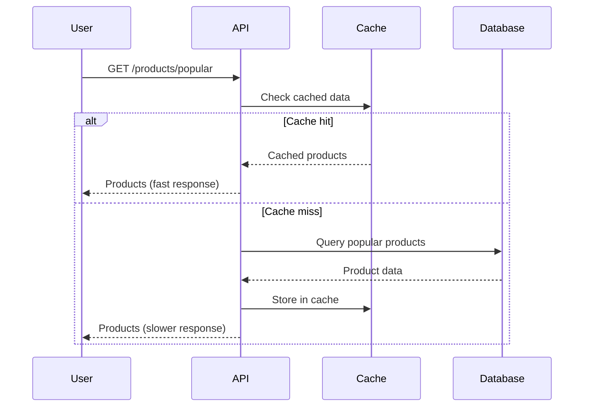
```mermaid
sequenceDiagram
    participant User
    participant API
    participant Cache
    participant Database

    User->>API: GET /products/popular
    API->>Cache: Check cached data
    
    alt Cache hit
        Cache-->>API: Cached products
        API-->>User: Products (fast response)
    else Cache miss
        API->>Database: Query popular products
        Database-->>API: Product data
        API->>Cache: Store in cache
        API-->>User: Products (slower response)
    end
```

## Nəticə

Sequence diaqramları proqram təminatı inkişafının müxtəlif mərhələlərində vacib rol oynayır:

- **Dizayn mərhələsində**: Obyektlər arası qarşılıqlı əlaqənin planlaşdırılması
- **İmplementasiya zamanı**: API çağırışlarının ardıcıllığının təyin edilməsi  
- **Test mərhələsində**: Test ssenarilərinə yaradılması
- **Sənədləşdirmədə**: Sistem davranışının vizual təsviri
- **Debug prosesində**: Sistem axınının təhlil edilməsi

Düzgün hazırlanmış sequence diaqramları:
- Mürəkkəb proseslərin anlaşılmasını asanlaşdırır
- Komanda üzvləri arasında ünsiyyəti təkmilləşdirir
- API dizaynının optimallaşdırılmasına kömək edir
- Test coverage-in artırılmasında istiqamət verir
- Sistem performansının təhlil edilməsini dəstəkləyir