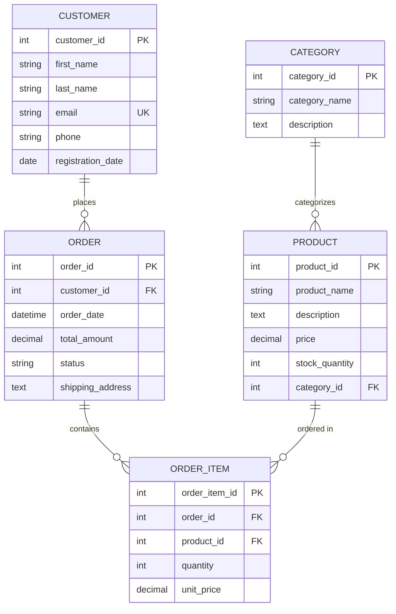
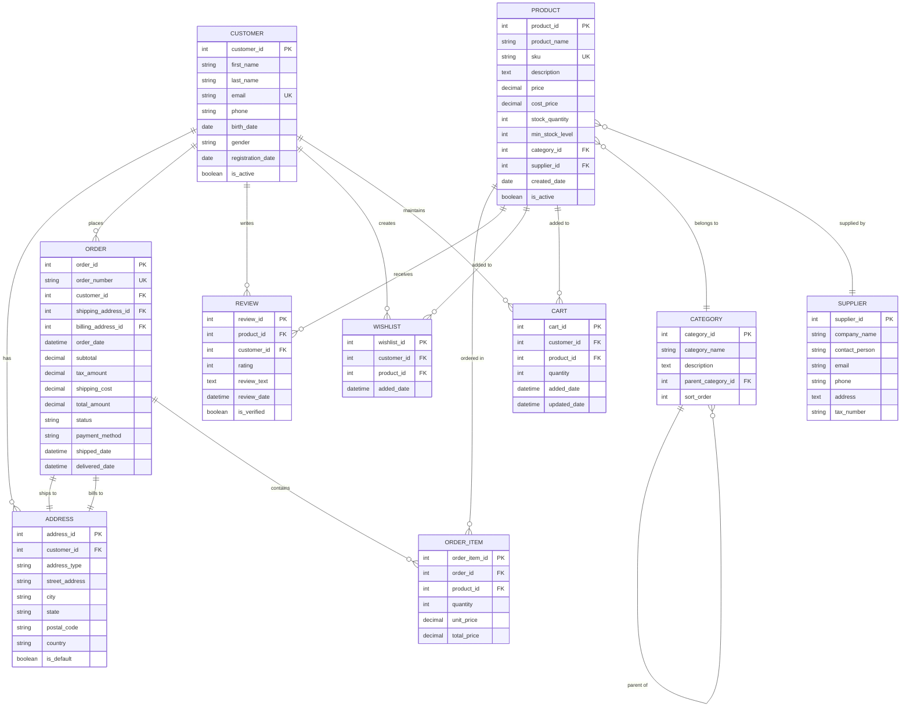

# Entity-Relationship (E-R) Diaqramları

Entity-Relationship (E-R) diaqramları verilənlər bazası dizaynı üçün ən mühüm alətlərdən biridir. Bu diaqramlar real dünyada mövcud olan obyektlər (entities), onların xüsusiyyətləri (attributes) və aralarındaki əlaqələri (relationships) vizual şəkildə təsvir edir.

E-R diaqramları verilənlər bazası dizaynının konseptual mərhələsində istifadə olunur və mürəkkəb verilənlər strukturlarının anlaşılmasını, planlaşdırılmasını və kommunikasiya edilməsini asanlaşdırır. Bu diaqramlar həmçinin mövcud sistemlərin analizi və təkmilləşdirilməsi üçün də çox faydalıdır.

## E-R Diaqramının Əsas Komponentləri

### 1. Entity (Varliq)

Entity real dünyada mövcud olan və haqqında məlumat saxlanmalı olan obyektdir. Məsələn: Müştəri, Məhsul, Sifariş, Şirkət və s.

**Xüsusiyyətləri:**
- Düzbucaqlı formada təsvir edilir
- Adı böyük hərflərlə yazılır
- Əsas ad (noun) olmalıdır
- Müxtəlif nümunələri ola bilər

### 2. Attribute (Xüsusiyyət)

Attribute entity-nin xarakteristikasını və ya xüsusiyyətini təsvir edir.

**Attribute növləri:**
- **Simple Attribute**: Sadə, bölünməz xüsusiyyət (Ad, Yaş)
- **Composite Attribute**: Mürəkkəb, bölünə bilən (Tam Ad = Ad + Soyad)
- **Derived Attribute**: Hesablanan xüsusiyyət (Yaş = İndiki Tarix - Doğum Tarixi)
- **Multi-valued Attribute**: Çoxlu dəyərli (Telefon nömrələri)
- **Key Attribute**: Unikal identifikator (ID, E-mail)

### 3. Relationship (Əlaqə)

İki və ya daha çox entity arasında olan əlaqəni təsvir edir.

**Relationship növləri:**
- **One-to-One (1:1)**: Hər entity digərindən yalnız bir nümunə ilə əlaqəli
- **One-to-Many (1:N)**: Bir entity digərindən çoxlu nümunə ilə əlaqəli
- **Many-to-Many (M:N)**: Hər iki entity çoxlu nümunələrlə əlaqəli

### 4. Cardinality (Kardinalite)

Relationship-də iştirak edən entity nümunələrinin sayını göstərir.

## E-R Diaqram Notasiyaları

### Chen Notasiyası (Klassik)
- **Entity**: Düzbucaqlı
- **Attribute**: Oval
- **Relationship**: Romb
- **Primary Key**: Altı xəttli attribute
- **Derived Attribute**: Qırıqlı xəttli oval

### Crow's Foot Notasiyası (Müasir)
- **Entity**: Düzbucaqlı cədvəl
- **Relationship**: Xətlər və simvollar
- **One**: Düz xətt
- **Many**: Qarğa ayağı simvolu

## Praktik Nümunə: E-ticarət Sistemi

### Sadə E-ticarət E-R Diaqramı



### Mürəkkəb E-ticarət E-R Diaqramı



## E-R Diaqram Yaratma Prosesi

### 1. Tələblərin Analizi
- Biznes tələblərini anlayın
- Domain ekspertləri ilə məsləhətləşin
- Məlumat axınlarını müəyyənləşdirin

### 2. Entity-lərin Müəyyənləşdirilməsi
- Məlumat saxlanmalı olan əsas obyektləri tapın
- Entity adlarını müəyyənləşdirin
- Entity-lər arasında fərqləri anlayın

### 3. Attribute-ların Müəyyənləşdirilməsi
- Hər entity üçün xüsusiyyətləri siyahıya alın
- Primary key-ləri müəyyənləşdirin
- Required və optional field-ləri fərqləndirin

### 4. Relationship-lərin Qurulması
- Entity-lər arasında əlaqələri müəyyənləşdirin
- Cardinality-ni təyin edin
- Foreign key-ləri müəyyənləşdirin

### 5. Normalizasiya
- Redundancy-ni aradan qaldırın
- Normal formaları tətbiq edin
- Performance-ı nəzərə alın

## Advanced Konceptlər

### Weak Entity (Zəif Entity)
- Müstəqil mövcud ola bilməyən entity
- Qoşa xəttli düzbucaqlı ilə gösterilir
- İkili xəttli romb ilə strong entity-yə bağlanır

### ISA Hierarchy (Inheritance)
- Ümumiləşdirmə və ixtisaslaşdırma
- Supertype və subtype entity-lər
- Üçbucaq simvolu ilə gösterilir

### Aggregation
- Relationship-lərin entity kimi istifadəsi
- Mürəkkəb strukturların təsviri
- Qoşa xəttli romb

## E-R Diaqramdan Relational Schema-ya Çevrilmə

### Entity Çevrilməsi
```sql
-- CUSTOMER entity
CREATE TABLE Customer (
    customer_id INT PRIMARY KEY,
    first_name VARCHAR(50) NOT NULL,
    last_name VARCHAR(50) NOT NULL,
    email VARCHAR(100) UNIQUE NOT NULL,
    phone VARCHAR(20),
    registration_date DATE DEFAULT CURRENT_DATE
);
```

### One-to-Many Relationship
```sql
-- ORDER entity with foreign key
CREATE TABLE Order (
    order_id INT PRIMARY KEY,
    customer_id INT NOT NULL,
    order_date DATETIME DEFAULT CURRENT_TIMESTAMP,
    total_amount DECIMAL(10,2),
    FOREIGN KEY (customer_id) REFERENCES Customer(customer_id)
);
```

### Many-to-Many Relationship
```sql
-- ORDER_ITEM junction table
CREATE TABLE Order_Item (
    order_item_id INT PRIMARY KEY,
    order_id INT NOT NULL,
    product_id INT NOT NULL,
    quantity INT NOT NULL,
    unit_price DECIMAL(10,2),
    FOREIGN KEY (order_id) REFERENCES Order(order_id),
    FOREIGN KEY (product_id) REFERENCES Product(product_id)
);
```

## E-R Diaqramların Üstünlükləri

### 1. **Vizual Təqdimat**
- Mürəkkəb strukturları sadələşdirir
- Texniki olmayan şəxslər üçün anlaşıqlıdır
- Komanda üzvləri arasında kommunikasiyanı asanlaşdırır

### 2. **Dizayn Doğruluğu**
- Verilənlər redundancy-sini azaldır
- Data integrity-ni artırır
- Normalizasiya prinsiplərinin tətbiqini dəstəkləyir

### 3. **Dokumentasiya**
- Sistemin struktur dokumentasiyası
- Gələcək dəyişikliklər üçün əsas
- Knowledge transfer üçün faydalı

## Ən Yaxşı Təcrübələr

### 1. **Adlandırma Konvensiyaları**
```text
✅ Düzgün:
- Entity adları: CUSTOMER, ORDER, PRODUCT
- Attribute adları: customer_id, first_name, order_date
- Relationship adları: places, contains, belongs_to

❌ Yanlış:
- Entity adları: customer, Orders, product_table
- Attribute adları: custID, firstName, OrderDate
- Relationship adları: rel1, connection, link
```

### 2. **Cardinalit və Participation**
```text
✅ Düzgün:
- (1,1): Total participation, exactly one
- (0,1): Partial participation, at most one  
- (1,N): Total participation, at least one
- (0,N): Partial participation, zero or more

❌ Yanlış:
- Qeyri-dəqiq cardinality təyini
- Participation constraints-in yoxlanmaması
```

### 3. **Normalizasiya**
```text
✅ 1NF: Atomic values, no repeating groups
✅ 2NF: Remove partial dependencies
✅ 3NF: Remove transitive dependencies
✅ BCNF: Every determinant is a candidate key
```

### 4. **Performance Nəzərə Alma**
- Çox istifadə edilən query-lər üçün denormalization
- Index strategiyaları
- Partitioning imkanları

## Çətinliklər və Həllər

### 1. **Mürəkkəb Business Logic**
**Problem**: Çox mürəkkəb business rule-lar
**Həll**: Constraint və trigger istifadəsi

### 2. **Performance Issues**
**Problem**: Normalizasiya səbəbindən yavaş query-lər
**Həll**: Strategik denormalization

### 3. **Scalability**
**Problem**: Böyük data həcmləri
**Həll**: Sharding və partitioning

## Nəticə

E-R diaqramları verilənlər bazası dizaynının əsasını təşkil edir və uğurlu məlumat sistemlərinin yaradılması üçün vacibdir. Düzgün hazırlanmış E-R diaqramı:

- Məlumat strukturunu aydın şəkildə təsvir edir
- Data integrity-ni təmin edir  
- Gələcək genişlənmələr üçün əsas yaradır
- Komanda üzvləri arasında ümumi anlayış formalaşdırır

Modern verilənlər bazası dizaynında E-R diaqramları hələ də ən effektiv və geniş istifadə edilən alətlərdən biridir.